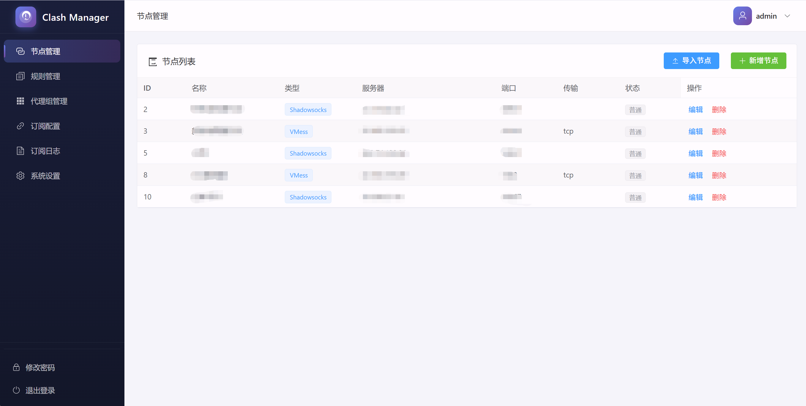
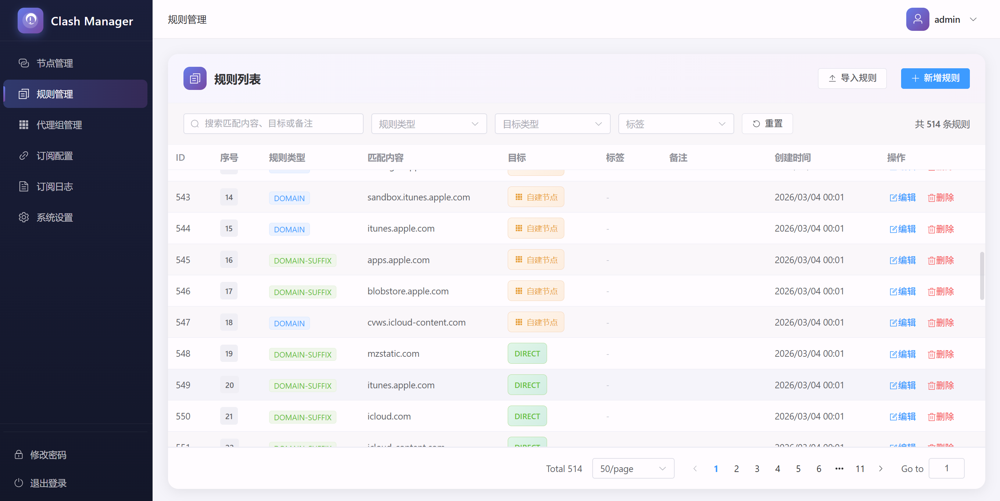
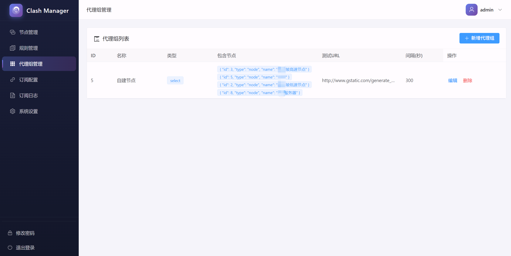
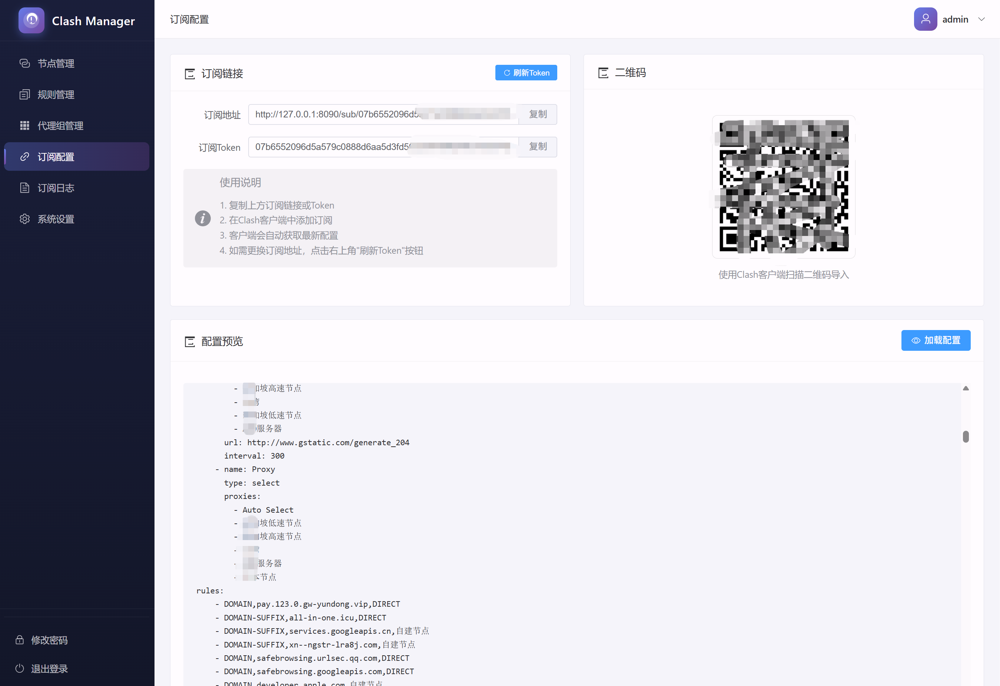
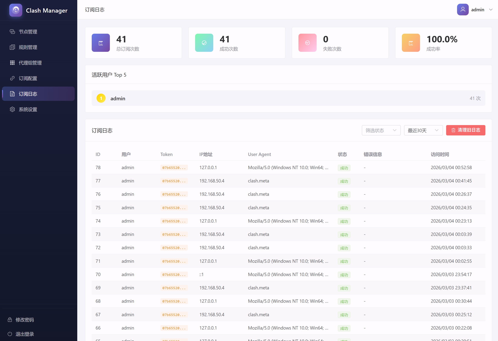
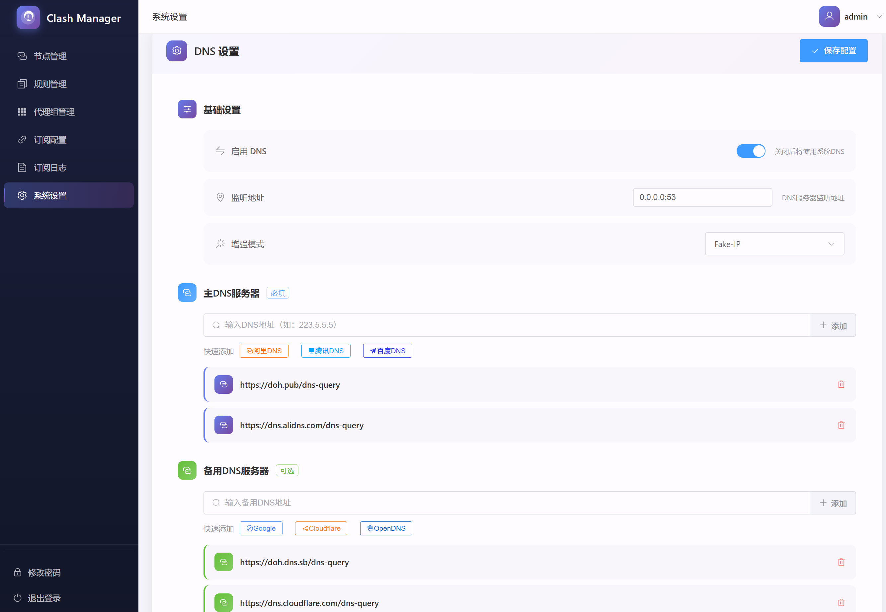

<div align="center">

# Clash Manager

**一个现代化的 Clash/Mihomo 配置管理与订阅分发系统**

[](https://golang.org/)
[](https://vuejs.org/)
[](LICENSE)

</div>

## 简介

Clash Manager 是一个功能完整的 Web 管理系统，用于管理 Clash/Mihomo 代理配置。它提供了直观的 Web 界面，支持节点管理、规则配置、策略组设置、DNS 配置、订阅生成等功能，帮助用户轻松管理和分发代理配置。

## 核心特性

### 🌐 代理节点管理
- 支持多种代理协议：Shadowsocks、VMess、VLESS、Trojan、Hysteria2、SOCKS5、HTTP
- 节点批量导入（支持分享链接）
- 节点配置可视化编辑
- WebSocket/gRPC/H2 传输协议支持

### 📋 规则管理
- 灵活的路由规则配置（DOMAIN、DOMAIN-SUFFIX、DOMAIN-KEYWORD、IP-CIDR、GEOIP、MATCH 等）
- 规则优先级排序
- 规则批量导入（支持 YAML 格式）
- **规则标签分类**：支持自定义标签（购物、运营商、视频、游戏等），便于分类管理
- 多条件筛选：按类型、关键词、目标、标签筛选

### 🎯 策略组管理
- 多种选择模式：手动选择、自动测速、故障转移、负载均衡
- 策略组可视化配置
- 支持节点和策略组组合

### ⚙️ DNS 配置
- 自定义 DNS 服务器设置
- Fake-IP 模式支持
- 增强模式配置
- DNS 规则配置

### 📡 订阅分发
- 生成专属订阅链接
- 访问日志记录（包含 IP、User-Agent、访问时间）
- 在线用户监控
- 订阅统计（访问次数、成功失败率）
- 订阅令牌管理与刷新

### 👤 用户系统
- JWT 认证
- 密码修改功能
- 命令行密码重置工具

### 🔧 系统功能
- 配置预览：实时预览生成的 Clash 配置
- 配置验证：自动验证配置合法性
- 数据自动迁移
- 静态资源打包（单文件部署）

## 技术栈

### 后端
- **语言**: Go 1.24+
- **框架**: Gin - 高性能 Web 框架
- **数据库**: SQLite + GORM
- **认证**: JWT (golang-jwt/jwt/v5)
- **配置**: YAML (gopkg.in/yaml.v3)
- **密码**: bcrypt

### 前端
- **框架**: Vue.js 3.4+
- **UI 组件**: Element Plus
- **状态管理**: Pinia
- **路由**: Vue Router 4
- **构建工具**: Vite
- **HTTP 客户端**: Axios
- **图标**: Element Plus Icons

## 快速开始

### 环境要求
- Go 1.24 或更高版本
- Node.js 18 或更高版本

### 安装与运行

#### 方式一：使用预编译二进制文件（推荐）

```bash
# Windows
clash-manager.exe

# Linux/macOS
chmod +x clash-manager
./clash-manager
```

#### 方式二：从源码运行

**1. 克隆仓库**
```bash
git clone https://github.com/yourusername/ClashManager.git
cd ClashManager
```

**2. 运行后端服务**
```bash
go run cmd/server/main.go
```

后端默认运行在 `http://localhost:8090`

**3. 前端开发（可选）**
```bash
cd web

# 安装依赖
npm install

# 开发模式
npm run dev

# 构建生产版本
npm run build
```

#### 方式三：打包部署

```bash
# 构建前端
cd web
npm run build

# 复制前端构建产物到后端目录
# Windows
copy /Y dist ..\cmd\server\dist

# Linux/macOS
cp -r dist ../cmd/server/dist

# 编译后端（包含前端静态资源）
cd ..
go build -o clash-manager cmd/server/main.go

# 运行打包后的程序
./clash-manager
```

### 首次使用

1. 访问 `http://localhost:8090`
2. 首次访问会自动跳转到初始化页面
3. 创建管理员账号（用户名和密码）
4. 登录后即可开始配置

## 命令行工具

### 服务器启动选项

```bash
# 指定端口运行
go run cmd/server/main.go --port 9090

# 重置 admin 密码
go run cmd/server/main.go --reset-admin=新密码

# 编译后使用
./clash-manager --port 9090
./clash-manager --reset-admin=新密码
```

### 配置说明

#### 默认配置
- 服务器端口: `:8090`
- 数据库路径: `data/clash.db`（自动在可执行文件目录或当前工作目录创建）

#### 修改默认配置
编辑 `internal/config/config.go` 中的配置常量。

## 功能说明

### 支持的节点类型

| 类型 | 说明 | 必填字段 |
|------|------|----------|
| Shadowsocks | SS 协议 | server, port, password, cipher |
| VMess | VMess 协议 | server, port, uuid, alterId |
| VLESS | VLESS 协议 | server, port, uuid |
| Trojan | Trojan 协议 | server, port, password |
| Hysteria2 | Hysteria2 协议 | server, port, password |
| SOCKS5 | SOCKS5 代理 | server, port |
| HTTP | HTTP 代理 | server, port |

**通用可选字段：**
- `udp` - UDP 支持
- `tls` - TLS 加密
- `skip-cert-verify` - 跳过证书验证
- `network` - 传输协议 (ws/grpc/h2)
- `path` - 路径
- `host` - SNI/Host 头

### 支持的规则类型

| 类型 | 说明 | 示例 |
|------|------|------|
| DOMAIN | 精确域名匹配 | `google.com` |
| DOMAIN-SUFFIX | 域名后缀匹配 | `.google.com` |
| DOMAIN-KEYWORD | 域名关键词匹配 | `google` |
| IP-CIDR | IP 段匹配 | `192.168.1.0/24` |
| GEOIP | 地理位置匹配 | `CN`, `US` |
| SRC-IP-CIDR | 源 IP 段匹配 | `192.168.1.0/24` |
| SRC-PORT | 源端口匹配 | `80`, `443` |
| DST-PORT | 目标端口匹配 | `80`, `443` |
| PROCESS-NAME | 进程名匹配 | `chrome.exe` |
| MATCH | 兜底规则 | - |

### 规则目标类型

| 类型 | 说明 | 存储内容 |
|------|------|----------|
| builtin | 内置目标 | 直接存储名称（DIRECT, PROXY, REJECT） |
| node | 代理节点 | 存储节点 ID（字符串） |
| group | 策略组 | 存储策略组 ID（字符串） |

**说明**：节点和策略组改名时，规则会自动使用新名称（通过 ID 引用）。

### 规则标签

规则支持自定义标签，用于分类管理：
- 可自由输入任意标签名称
- 过滤条件自动从已有标签中聚合获取
- 保存时自动去除前后空格

**示例标签**：购物、运营商、视频、游戏、社交、工作、工具、其他

## API 接口文档

### 认证接口
| 方法 | 路径 | 描述 |
|------|------|------|
| POST | `/api/auth/login` | 用户登录 |
| POST | `/api/auth/setup` | 初始化系统（首次访问） |
| POST | `/api/auth/register` | 创建用户（需认证） |
| POST | `/api/auth/password` | 修改密码（需认证） |

### 节点管理
| 方法 | 路径 | 描述 |
|------|------|------|
| GET | `/api/nodes` | 获取节点列表 |
| POST | `/api/nodes` | 创建节点 |
| POST | `/api/nodes/import` | 导入节点（分享链接） |
| PUT | `/api/nodes/:id` | 更新节点 |
| DELETE | `/api/nodes/:id` | 删除节点 |

### 规则管理
| 方法 | 路径 | 描述 |
|------|------|------|
| GET | `/api/rules` | 获取规则列表（分页、筛选） |
| GET | `/api/rules/tags` | 获取所有标签列表 |
| POST | `/api/rules` | 创建规则 |
| POST | `/api/rules/import` | 导入规则（YAML） |
| PUT | `/api/rules/:id` | 更新规则 |
| DELETE | `/api/rules/:id` | 删除规则 |

**规则查询参数：**
- `page` - 页码（默认 1）
- `pageSize` - 每页数量（默认 50，最大 200）
- `type` - 规则类型筛选
- `keyword` - 关键词搜索（匹配 Payload、Target、Remark）
- `target` - 目标筛选
- `tag` - 标签筛选

### 策略组管理
| 方法 | 路径 | 描述 |
|------|------|------|
| GET | `/api/groups` | 获取策略组列表 |
| POST | `/api/groups` | 创建策略组 |
| PUT | `/api/groups/:id` | 更新策略组 |
| DELETE | `/api/groups/:id` | 删除策略组 |

### DNS 设置
| 方法 | 路径 | 描述 |
|------|------|------|
| GET | `/api/settings/dns` | 获取 DNS 配置 |
| POST | `/api/settings/dns` | 保存 DNS 配置 |

### 订阅管理
| 方法 | 路径 | 描述 |
|------|------|------|
| GET | `/api/subscription/token` | 获取订阅令牌 |
| POST | `/api/subscription/token/refresh` | 刷新订阅令牌 |
| GET | `/api/subscription/url` | 获取订阅链接 |
| GET | `/api/subscription/preview` | 预览配置（YAML 格式） |
| GET | `/api/subscription/logs` | 获取访问日志（分页） |
| GET | `/api/subscription/stats` | 获取订阅统计 |
| DELETE | `/api/subscription/logs/old` | 删除旧日志 |
| GET | `/api/subscription/online` | 获取在线用户 |

### 订阅获取（公开接口）
| 方法 | 路径 | 描述 |
|------|------|------|
| GET | `/sub/:token` | 获取 Clash 配置文件（YAML） |

## 项目结构

```
ClashManager/
├── cmd/
│   ├── server/              # 主程序入口
│   │   ├── main.go          # 服务器启动
│   │   └── embed.go         # 前端静态资源嵌入
│   └── reset-password/      # 密码重置工具
├── internal/
│   ├── api/                 # API 处理器
│   │   ├── handlers/        # 各功能处理器
│   │   ├── middleware/      # 中间件（认证等）
│   │   └── routes.go       # 路由注册
│   ├── config/              # 配置文件
│   ├── model/               # 数据模型
│   ├── repository/          # 数据访问层
│   │   ├── db.go           # 数据库初始化
│   │   ├── node_repo.go
│   │   ├── rule_repo.go
│   │   ├── group_repo.go
│   │   ├── user_repo.go
│   │   └── ...
│   ├── service/             # 业务逻辑层
│   │   └── generator.go    # Clash 配置生成
│   └── server/              # 服务器初始化
├── web/                     # 前端代码
│   ├── src/
│   │   ├── api/             # API 调用
│   │   ├── router/          # 路由配置
│   │   ├── stores/          # Pinia 状态管理
│   │   ├── views/           # 页面组件
│   │   ├── App.vue          # 主应用组件
│   │   └── main.ts          # 入口文件
│   ├── index.html
│   ├── vite.config.js
│   └── package.json
├── data/                    # 数据库文件（自动创建）
├── docs/                    # 文档
└── build.bat                # Windows 打包脚本
```

## 开发指南

### 本地开发环境搭建

**后端开发：**
```bash
# 安装依赖
go mod download

# 运行开发服务器
go run cmd/server/main.go
```

**前端开发：**
```bash
cd web

# 安装依赖
npm install

# 启动开发服务器（自动代理后端 API）
npm run dev
```

### 添加新的代理协议

1. 在 `internal/model/db_model.go` 的 `Node` 结构体中添加新协议需要的字段
2. 在 `web/src/views/Nodes.vue` 中添加表单输入字段
3. 在 `internal/service/generator.go` 的节点生成逻辑中添加新协议支持

### 添加新的规则类型

1. 在 `web/src/views/Rules.vue` 的规则类型选项中添加新类型
2. 在 `internal/service/generator.go` 中添加新类型的规则生成逻辑

## 配置验证

系统会自动验证生成的 Clash 配置，检测以下问题：

### 节点验证
- 名称、服务器地址、端口必填
- 端口范围检查（1-65535）
- 协议特定字段验证（如 Shadowsocks 需要 cipher 和 password，VMess 需要 uuid）

### 规则验证
- 类型、匹配内容必填
- 支持的规则类型检查
- IP-CIDR 自动补全子网掩码（/32）
- 目标存在性检查（节点、策略组、内置目标）

### 策略组验证
- 名称必填
- 类型验证（select、url-test、fallback、load-balance）

## 部署说明

### 生产环境部署

1. **构建前端**
```bash
cd web
npm run build
```

2. **打包后端**
```bash
# Windows
build.bat

# Linux/macOS
go build -o clash-manager cmd/server/main.go
```

3. **运行**
```bash
./clash-manager --port 8090
```

### 使用反向代理

#### Nginx 配置示例
```nginx
server {
    listen 80;
    server_name your-domain.com;

    location / {
        proxy_pass http://localhost:8090;
        proxy_set_header Host $host;
        proxy_set_header X-Real-IP $remote_addr;
        proxy_set_header X-Forwarded-For $proxy_add_x_forwarded_for;
        proxy_set_header X-Forwarded-Proto $scheme;
    }
}
```

#### Docker 部署（可选）

```dockerfile
FROM golang:1.24-alpine AS builder
WORKDIR /app
COPY . .
RUN go build -o clash-manager cmd/server/main.go

FROM alpine:latest
RUN apk --no-cache add ca-certificates
WORKDIR /app
COPY --from=builder /app/clash-manager .
EXPOSE 8090
CMD ["./clash-manager"]
```

## 功能截图

### 节点管理


支持多种代理协议的节点管理，包括批量导入、可视化编辑等功能。

### 规则管理


灵活的路由规则配置，支持规则标签分类、多条件筛选、批量导入等功能。

### 策略组管理


策略组可视化配置，支持手动选择、自动测速、故障转移、负载均衡等多种模式。

### 订阅管理


生成专属订阅链接，查看访问日志和订阅统计，管理在线用户。

### 日志管理


详细的访问日志记录，包含 IP、User-Agent、访问时间等信息。

### 设置


DNS 配置、系统设置等功能。

## 常见问题

### Q: 如何重置管理员密码？
A: 使用命令行工具：
```bash
go run cmd/server/main.go --reset-admin=新密码
```

### Q: 如何更改端口？
A: 启动时指定端口：
```bash
go run cmd/server/main.go --port 9090
```

### Q: 数据存储在哪里？
A: 默认在可执行文件同目录的 `data/clash.db`，也可在当前工作目录的 `data/clash.db`。

### Q: 忘记的订阅链接格式是什么？
A: `http://your-domain:8090/sub/{token}`

## 路线图

- [x] 基础 CRUD 功能
- [x] 用户认证与授权
- [x] 订阅分发
- [x] 前端 UI 优化
- [x] 规则标签分类
- [x] 配置预览与验证
- [ ] 多租户支持
- [ ] 规则订阅源
- [ ] 节点测速
- ] 更多...

## 贡献

欢迎提交 Issue 和 Pull Request！

1. Fork 本仓库
2. 创建特性分支 (`git checkout -b feature/AmazingFeature`)
3. 提交更改 (`git commit -m 'Add some AmazingFeature'`)
4. 推送到分支 (`git push origin feature/AmazingFeature`)
5. 提交 Pull Request

## 许可证

本项目采用 MIT 许可证 - 详见 [LICENSE](LICENSE) 文件

## 致谢

- [Clash](https://github.com/Dreamacro/clash) - 核心代理引擎
- [Mihomo](https://github.com/MetaCubeX/mihomo) - Clash 内核的持续维护版本
- [Gin](https://github.com/gin-gonic/gin) - Go Web 框架
- [Vue.js](https://vuejs.org/) - 渐进式 JavaScript 框架
- [Element Plus](https://element-plus.org/) - Vue 3 组件库

---

<div align="center">

**如果这个项目对你有帮助，请给一个 Star ⭐**

</div>
